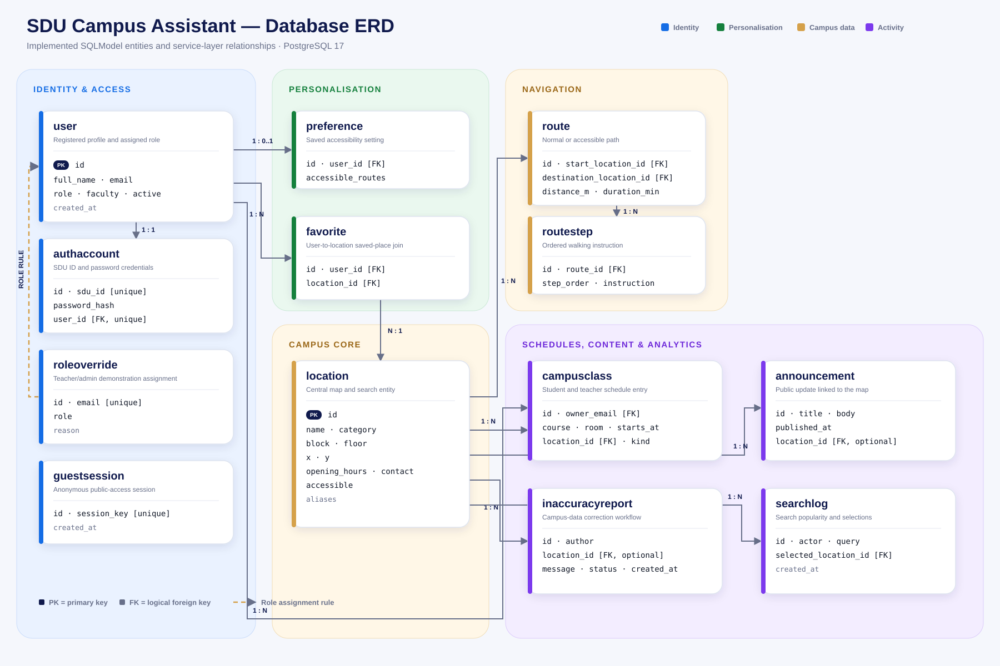
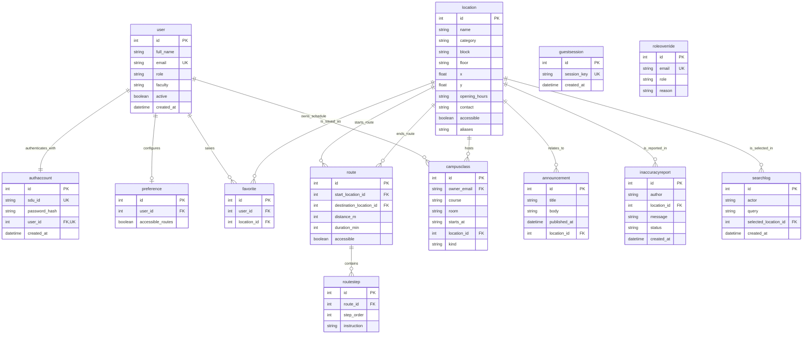

# SDU Campus Assistant Database Schema

**Version:** 1.0  
**Database:** PostgreSQL 17 for the full demonstration; SQLite for lightweight local development  
**Data layer:** SQLModel + SQLAlchemy  
**API:** FastAPI

## 1. Purpose

The database supports role-based authentication, guest sessions, campus locations, routes, saved places, accessibility preferences, schedules, announcements, information reports, and search analytics.

The running schema is created from the SQLModel classes in `backend/app/main.py`. PostgreSQL data is persisted in the Docker volume `sdu_postgres_data`.

## 2. High-level data domains

| Domain | Tables |
|---|---|
| Identity and access | `user`, `authaccount`, `guestsession`, `roleoverride` |
| Personalisation | `preference`, `favorite` |
| Campus navigation | `location`, `route`, `routestep` |
| Academic information | `campusclass` |
| Campus communication | `announcement`, `inaccuracyreport` |
| Analytics | `searchlog` |

## 3. Entity-relationship diagram

The following diagram shows the logical relationships used by the application service layer.



Presentation exports are available as [`docs/database-erd.svg`](docs/database-erd.svg) and [`docs/database-erd.png`](docs/database-erd.png). The SVG is recommended for slides because it remains sharp at any size.



## 4. Table dictionary

### `user`

Stores the application profile and assigned role for every registered person.

| Column | Type | Rules | Purpose |
|---|---|---|---|
| `id` | Integer | Primary key | Internal user identifier |
| `full_name` | String | Required | Display name |
| `email` | String | Required, unique, indexed | Internal SDU identity key derived as `{sdu_id}@sdu.edu.kz` |
| `role` | String | Required, indexed | `student`, `teacher`, or `admin` |
| `faculty` | String | Required; default `SDU` | Organisational information |
| `active` | Boolean | Required; default `true` | Enables account suspension |
| `created_at` | Date/time | Required | Account creation audit timestamp |

The mobile interface uses only the nine-digit SDU ID. The internal email-shaped key is retained for compatibility with seeded schedule and role data.

### `authaccount`

Separates login credentials from the public user profile.

| Column | Type | Rules | Purpose |
|---|---|---|---|
| `id` | Integer | Primary key | Credential record identifier |
| `sdu_id` | String | Required, unique, indexed | Nine-digit login ID |
| `password_hash` | String | Required | Salted PBKDF2-SHA256 password representation |
| `user_id` | Integer | Required, unique, indexed; logical FK → `user.id` | One-to-one profile link |
| `created_at` | Date/time | Required | Credential creation timestamp |

Passwords are never stored as plain text. Each hash uses a random 16-byte salt and 600,000 PBKDF2 iterations.

### `guestsession`

Stores anonymous sessions created by **Continue as Guest**.

| Column | Type | Rules | Purpose |
|---|---|---|---|
| `id` | Integer | Primary key | Guest record identifier |
| `session_key` | String | Required, unique, indexed | Random UUID used as the token subject |
| `created_at` | Date/time | Required | Session creation timestamp |

Guest sessions do not own favourites, saved preferences, schedules, or reports.

### `roleoverride`

Assigns demonstration roles that cannot yet be inferred from the numeric ID.

| Column | Type | Rules | Purpose |
|---|---|---|---|
| `id` | Integer | Primary key | Override identifier |
| `email` | String | Required, unique, indexed | Internal SDU identity key |
| `role` | String | Required | Assigned teacher/admin role |
| `reason` | String | Required | Audit explanation |

New accounts default to Student unless an override exists.

### `preference`

Stores registered-user navigation preferences.

| Column | Type | Rules | Purpose |
|---|---|---|---|
| `id` | Integer | Primary key | Preference identifier |
| `user_id` | Integer | Required, indexed; logical FK → `user.id` | Preference owner |
| `accessible_routes` | Boolean | Required; default `false` | Prefer step-free routes and elevators |

### `location`

The central campus entity used by map pins, search, routes, schedules, and announcements.

| Column | Type | Rules | Purpose |
|---|---|---|---|
| `id` | Integer | Primary key | Location identifier |
| `name` | String | Required, indexed | Human-readable name or room code |
| `category` | String | Required, indexed | Classroom, Food, Study, Office, etc. |
| `block` | String | Required, indexed | Campus block A–H |
| `floor` | String | Required | Floor description |
| `x`, `y` | Float | Required | Normalised map coordinates from 0.0 to 1.0 |
| `opening_hours` | String | Required | Display-ready opening hours |
| `contact` | String | Required | Phone or service contact |
| `accessible` | Boolean | Required | Entrance/elevator accessibility flag |
| `aliases` | String | Required | Comma-separated alternate search terms |

Normalised coordinates allow the same location records to be drawn responsively over the campus-map image.

### `route`

Stores a route option between two campus locations.

| Column | Type | Rules | Purpose |
|---|---|---|---|
| `id` | Integer | Primary key | Route identifier |
| `start_location_id` | Integer | Required; logical FK → `location.id` | Route origin |
| `destination_location_id` | Integer | Required; logical FK → `location.id` | Route destination |
| `distance_m` | Integer | Required | Walking distance in metres |
| `duration_min` | Integer | Required | Estimated walking time |
| `accessible` | Boolean | Required; default `false` | Step-free route indicator |

### `routestep`

Stores ordered instructions for a route.

| Column | Type | Rules | Purpose |
|---|---|---|---|
| `id` | Integer | Primary key | Step identifier |
| `route_id` | Integer | Required, indexed; logical FK → `route.id` | Parent route |
| `step_order` | Integer | Required | Display order |
| `instruction` | String | Required | Human-readable instruction |

### `favorite`

Join table for registered users and saved campus locations.

| Column | Type | Rules | Purpose |
|---|---|---|---|
| `id` | Integer | Primary key | Saved-place identifier |
| `user_id` | Integer | Required, indexed; logical FK → `user.id` | Owner |
| `location_id` | Integer | Required, indexed; logical FK → `location.id` | Saved destination |

Guests cannot create favourite records. Tapping a saved place in Flutter opens that location on the map and exposes the Route action.

### `campusclass`

Stores seeded student timetables and teacher schedules.

| Column | Type | Rules | Purpose |
|---|---|---|---|
| `id` | Integer | Primary key | Class identifier |
| `owner_email` | String | Required, indexed; logical link → `user.email` | Schedule owner |
| `course` | String | Required | Course name |
| `room` | String | Required | Room code |
| `starts_at` | String | Required | Display-ready class time |
| `location_id` | Integer | Required; logical FK → `location.id` | Map destination |
| `kind` | String | Required | `student` or `teacher` schedule entry |

### `announcement`

Stores public campus news and location-linked events.

| Column | Type | Rules | Purpose |
|---|---|---|---|
| `id` | Integer | Primary key | Announcement identifier |
| `title` | String | Required | Headline |
| `body` | String | Required | Announcement content |
| `published_at` | Date/time | Required | Publication timestamp |
| `location_id` | Integer | Nullable; logical FK → `location.id` | Optional map destination |

### `inaccuracyreport`

Tracks registered-user reports for outdated campus information.

| Column | Type | Rules | Purpose |
|---|---|---|---|
| `id` | Integer | Primary key | Report identifier |
| `author` | String | Required | User identity recorded with the report |
| `location_id` | Integer | Nullable; logical FK → `location.id` | Reported location |
| `message` | String | Required | Requested correction |
| `status` | String | Required, indexed; default `new` | Review workflow state |
| `created_at` | Date/time | Required | Submission timestamp |

### `searchlog`

Provides aggregate search analytics without changing location records.

| Column | Type | Rules | Purpose |
|---|---|---|---|
| `id` | Integer | Primary key | Search event identifier |
| `actor` | String | Required | User/session label |
| `query` | String | Required, indexed | Search phrase |
| `selected_location_id` | Integer | Nullable; logical FK → `location.id` | Chosen result, when recorded |
| `created_at` | Date/time | Required | Search timestamp |

## 5. Authentication and authorisation flow

1. Registration validates a nine-digit SDU ID and a password of at least eight characters.
2. The backend creates a `user` profile and an `authaccount` password record.
3. Teacher and administrator demonstration IDs are resolved through `roleoverride`; other new IDs default to Student.
4. Login verifies the PBKDF2 password hash.
5. FastAPI issues a 12-hour HS256 JWT containing the SDU ID and role.
6. Protected endpoints resolve the token identity and enforce registered-user, teacher, or administrator access.
7. Guest access creates a `guestsession` and a JWT with the `guest` role.

## 6. Implemented indexes and uniqueness

The physical schema currently includes:

- Unique indexed `user.email`
- Unique indexed `authaccount.sdu_id`
- Unique indexed `authaccount.user_id`
- Unique indexed `guestsession.session_key`
- Unique indexed `roleoverride.email`
- Indexes on roles, names, categories, blocks, queries, report status, and relationship lookup fields

Relationships marked as **logical FK** are currently resolved by the FastAPI service layer. A production migration should add explicit PostgreSQL foreign-key constraints, cascade rules, and compound uniqueness such as `favorite(user_id, location_id)`.

## 7. Seeded demonstration data

The startup seed creates:

- Five students: Yerassyl, Daulet, Omar, Aitore, and Aidyn
- One teacher and one administrator
- Login credentials for each seeded account
- Twelve searchable campus locations
- Three location-linked announcements
- A Project Management class/schedule record for the demonstration accounts
- Teacher and administrator role overrides

The shared course-demo password is documented in `README.md`; the database stores only its salted hash.

## 8. Teacher demonstration in pgAdmin

Start the stack:

```bash
docker compose up --build -d
```

Open `http://127.0.0.1:5050` and register the PostgreSQL server:

| Setting | Value |
|---|---|
| Host | `database` |
| Port | `5432` |
| Database | `sdu_campus` |
| Username | `sdu` |
| Password | `sdu_demo_password` |

### Show users and roles

```sql
SELECT a.sdu_id, u.full_name, u.role, u.active, u.created_at
FROM authaccount AS a
JOIN "user" AS u ON u.id = a.user_id
ORDER BY u.role, u.full_name;
```

### Show saved places

```sql
SELECT u.full_name, l.name AS saved_location, l.block, l.floor
FROM favorite AS f
JOIN "user" AS u ON u.id = f.user_id
JOIN location AS l ON l.id = f.location_id
ORDER BY u.full_name, l.name;
```

### Show accessibility preferences

```sql
SELECT u.full_name, p.accessible_routes
FROM preference AS p
JOIN "user" AS u ON u.id = p.user_id;
```

### Show popular searches

```sql
SELECT query, COUNT(*) AS search_count
FROM searchlog
GROUP BY query
ORDER BY search_count DESC, query;
```

### Show information-report workflow

```sql
SELECT r.id, r.author, l.name AS location, r.message, r.status, r.created_at
FROM inaccuracyreport AS r
LEFT JOIN location AS l ON l.id = r.location_id
ORDER BY r.created_at DESC;
```

## 9. Source of truth

| Concern | Source |
|---|---|
| SQLModel table definitions | `backend/app/main.py` |
| PostgreSQL service configuration | `docker-compose.yml` |
| API request/response documentation | `http://127.0.0.1:8000/docs` |
| Product and role scope | `PROJECT_PLAN.md` |
